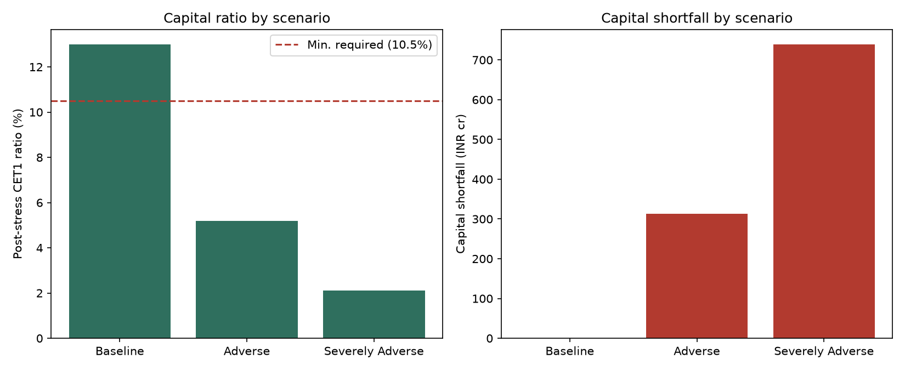

# Basel III Credit Risk & Stress Testing

Models PD, LGD, and EAD across a synthetic corporate loan portfolio, then runs two
recession stress scenarios to quantify the resulting capital shortfall against a
bank's regulatory minimum — the same shape of analysis used in ICAAP / capital
adequacy planning.

## Methodology

**Portfolio (`generate_portfolio.py`)** — synthesizes 750 corporate loans across
10 sectors, with a credit rating, seniority, collateral type/coverage, and
loan type (term vs. revolving), written to `loan_portfolio.xlsx`.

**PD** — each loan's baseline PD comes from its credit rating via a standard
1-year average default rate table (`RATING_PD`), with a small idiosyncratic
jitter per loan.

**Stress mechanism** — PD is shifted using the single-factor Vasicek/Merton
model behind Basel's IRB formula: a systematic factor `Z` (0 = average
conditions, negative = recession) moves every obligor's conditional PD
together —

```
PD(Z) = Φ[ (Φ⁻¹(PD) − √ρ · Z) / √(1−ρ) ]
```

— where `ρ` is the Basel corporate asset correlation, itself a function of
PD. Three scenarios are defined in `basel_stress_test.py`:

| Scenario | Z | LGD uplift |
|---|---|---|
| Baseline | 0.0 | 1.00x |
| Adverse | −1.5 | 1.15x |
| Severely Adverse | −2.5 | 1.30x |

**LGD** — a base LGD per loan from seniority (Senior Secured / Unsecured /
Subordinated) offset by collateral coverage and collateral-type
effectiveness (cash and marketable securities offset LGD more than plant &
machinery, for example). Each scenario then applies a downturn LGD uplift,
since collateral values and recovery rates fall in a recession.

**EAD** — drawn balance plus a 75% credit conversion factor on the undrawn
portion of revolving facilities (term loans are fully drawn, so CCF is 0).

**Capital requirement** — the Basel corporate IRB formula (BCBS,
*An Explanatory Note on the Basel II IRB Risk Weight Functions*) computes a
per-loan capital charge `K` at 99.9% confidence, with a maturity adjustment:

```
K = LGD · [ Φ( (Φ⁻¹(PD) + √ρ·Φ⁻¹(0.999)) / √(1−ρ) ) − PD ] · MA(PD, M)
RWA = 12.5 · K · EAD          Required capital = K · EAD  (= 8% of RWA)
```

**Capital adequacy** — the bank is assumed to start at a 13% CET1 ratio on
baseline RWA. Under each scenario, capital is reduced by the *incremental*
expected loss versus baseline (baseline EL is assumed already provisioned),
and the resulting post-stress ratio is compared against a 10.5% regulatory
minimum (8% Pillar 1 + 2.5% capital conservation buffer) to get the capital
shortfall.

**Simplifications** — CCF is not stressed; the starting capital figure is an
assumption, not a real reported CET1; and this uses static point-in-time
exposures rather than a multi-year balance-sheet projection. Documented here
rather than hidden in the code.

## Results (this seeded run)

| Scenario | Avg. stressed PD | Avg. stressed LGD | Post-stress CET1 ratio | Capital shortfall (INR cr) |
|---|---|---|---|---|
| Baseline | 1.50% | 32.4% | 13.00% | 0 |
| Adverse | 4.78% | 37.3% | 5.19% | 312.6 |
| Severely Adverse | 9.63% | 42.2% | 2.10% | 739.3 |

on a ₹5,300 cr EAD portfolio. Full detail (loan-level and scenario-level) is
written to `stress_test_results.xlsx`; a two-panel chart of the capital ratio
and shortfall by scenario is written to `capital_shortfall.png`.



## Power BI dashboard

`powerbi/` contains an interactive Power BI version of these results, with capital
adequacy by scenario, risk drivers by sector, rating and collateral, and loan-level
detail. Open `powerbi/BaselStressTest.pbip` in Power BI Desktop and refresh. See
[`powerbi/README.md`](powerbi/README.md).

## Usage

```bash
python3 -m venv .venv && source .venv/bin/activate
pip install -r requirements.txt

python3 generate_portfolio.py   # -> loan_portfolio.xlsx
python3 basel_stress_test.py    # -> stress_test_results.xlsx, capital_shortfall.png
```

## Repo structure

```
generate_portfolio.py     synthetic loan portfolio generator -> loan_portfolio.xlsx
basel_stress_test.py      PD/LGD/EAD -> Basel IRB capital -> stress scenarios -> capital shortfall
loan_portfolio.xlsx        750-loan synthetic input portfolio (generated by generate_portfolio.py, seeded — not committed)
stress_test_results.xlsx   scenario summary + loan-level output (generated by basel_stress_test.py — not committed)
capital_shortfall.png      capital ratio / shortfall chart (generated)
powerbi/                   Power BI project (BaselStressTest.pbip), its CSV data and export_powerbi_data.py
```
